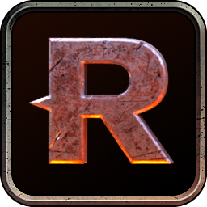

# Darktide Rebooter 🥾↪️🥾

**Automatically boot the game up again (and bypass the launcher) immediately after a crash. There's heresy to be smote and no time to waste.**

## Usage

un [`DarktideRebooter.exe`](https://github.com/ronvoluted/darktide-rebooter/releases/latest) and an icon will appear in your system tray monitoring for crashes. Darktide will now 'reboot' a second or two after crashing.

To pause this, click the icon to bring up a context menu and hit "Toggle monitoring" to deactivate/activate it. Hit "Exit" to... okay you know how to read.

> **Note for Game Pass players**
>
> You will need to save DarktideRebooter.exe to your game's installation path. By default this is `C:\XboxGames\Warhammer 40,000- Darktide\Content`. You can then create a shortcut to this file to save you from needing to always open it from this directory.
> 

## Complimentary mods
This pairs very nicely with [Log Me In](https://www.nexusmods.com/warhammer40kdarktide/mods/15) by raindish. Combined, it means you'll be taken back to the hub without all the clicks/presses of launching the game launcher, clicking PLAY in launcher, holding Space in the intro, hitting Space to sign-in and clicking Ready or Reconnect to join.

If you have a pristine PC and never crash but want to try this out of curiousity, install my [Crash](https://www.nexusmods.com/warhammer40kdarktide/mods/118) mod then enter `/crash 10` in the game's chat box 😉

### For modders
This was originally made to alleviate the pains of frequent crashes during mod development, so there's one extra skip you can do for modding. Grab [Psych Ward](https://www.nexusmods.com/warhammer40kdarktide/mods/89) by Fractality and modify the `mod:hook(StateMainMenu, "update", ...)` block so that the check for [`if _go_to_shooting_range then`](https://github.com/fracticality/darktide-mods/blob/a0d933563ed11b387eac748e1c5f2b26f69ef518/psych_ward/scripts/mods/psych_ward/psych_ward.lua#L208) is ignored/removed.

This will mean you're automatically brought straight back to the Psykhanium after crashing. I keep a separate, stripped down copy of the mod installed so these changes aren't wiped during updates.
